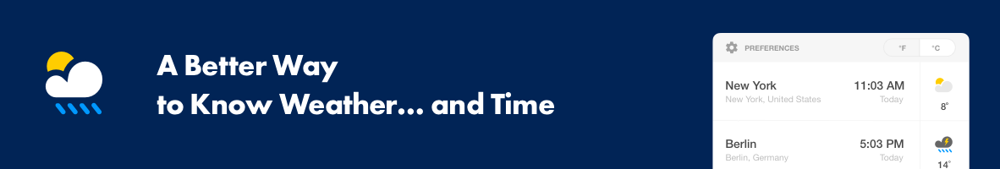
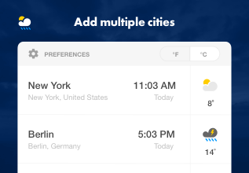
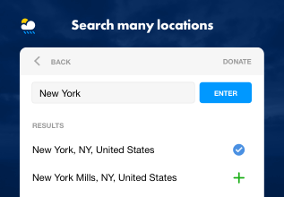
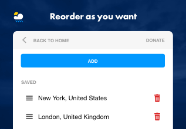

# Current Weather And Time Extension

> This is the best weather and time extension for your web-browser. 

> Add multiple cities and stay up to date with current time and weather in there!

## Screenshots

          

## How to Install

You can find it in  [Chrome Web Store](https://chrome.google.com/webstore/detail/weather-time-multi-city/oogbklojclobkhgadnhomfpoidemgima) and in [Firefox Browser Add-ons](https://addons.mozilla.org/en-US/firefox/addon/weather-time-multi-city/).
